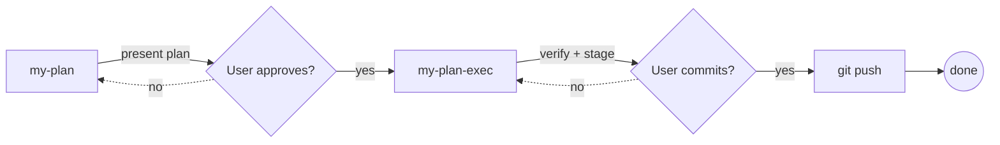
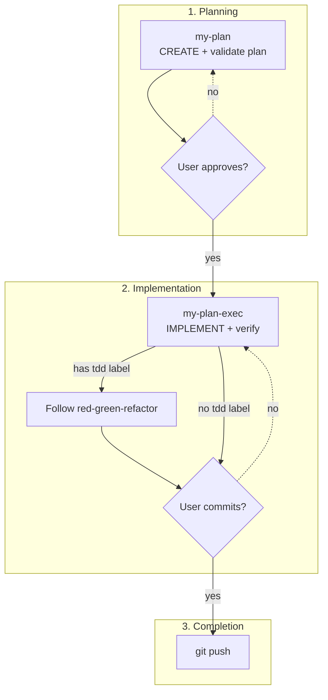

# OpenCode Config

Centralized OpenCode and Codex CLI configuration for syncing across multiple machines.

> **Note:** These agents and skill definitions were developed primarily for [OpenCode](https://opencode.ai), but may work out-of-the-box with other coding agent harnesses that support similar skill/agent formats (e.g., Codex CLI, Claude Code).

## Structure

```
opencode-config/                      # This git repo (your config)
├── .gitignore
├── README.md
├── setup.sh                          # Setup script for OpenCode and Codex
├── opencode.json                     # OpenCode config file (tracked)
├── skills/                           # Custom skills (tracked, works with both CLIs)
└── .opencode/
    └── agents/                       # Custom agents (OpenCode only)

~/.config/opencode/                   # OpenCode runtime directory
├── opencode.json -> <repo>/opencode.json    # Symlink (via setup.sh)
├── skills/ -> <repo>/skills/                # Symlink (via setup.sh)
├── agents/ -> <repo>/.opencode/agents/      # Symlink (via setup.sh)
├── node_modules/                     # Runtime (not tracked)
├── package.json                      # Runtime (not tracked)
└── bun.lock                          # Runtime (not tracked)

~/.codex/                             # Codex runtime directory
├── config.toml                       # Codex config (user-managed, TOML format)
├── config.json                       # Runtime settings (not tracked)
└── skills/                           # Skills directory
    ├── .system/                      # Codex system skills (managed by Codex)
    ├── github-ops/ -> <repo>/skills/github-ops/  # Custom skill (via setup.sh)
    └── ...other custom skills...     # (via setup.sh)
```

## Setup on a New Machine

### 1. Clone this repository

```bash
git clone https://github.com/chandima/opencode-config.git
cd opencode-config
```

### 2. Run setup script

```bash
./setup.sh              # Install OpenCode only (default)
./setup.sh opencode     # Install OpenCode only
./setup.sh --codex      # Install Codex only
./setup.sh --both       # Install both OpenCode and Codex
./setup.sh --help       # Show help
```

The script will:

- **OpenCode**: Symlink `opencode.json`, `skills/`, and `agents/` to `~/.config/opencode/`
- **Codex**: Symlink individual skills to `~/.codex/skills/` (preserves `.system/` directory)
- **Respects disabled skills**: Skills with `"deny"` permission in `opencode.json` are skipped for Codex

<details>
<summary>Manual alternative (without script)</summary>

**OpenCode:**

```bash
mkdir -p ~/.config/opencode
ln -sf "$(pwd)/opencode.json" ~/.config/opencode/opencode.json
ln -sfn "$(pwd)/skills" ~/.config/opencode/skills
ln -sfn "$(pwd)/.opencode/agents" ~/.config/opencode/agents
```

**Codex:**

```bash
for skill in skills/*; do
  ln -sfn "$(pwd)/$skill" ~/.codex/skills/$(basename "$skill")
done
```

</details>

### 3. Verify

```bash
ls -la ~/.config/opencode/    # OpenCode: opencode.json and skills/ symlinked
ls -la ~/.codex/skills/       # Codex: custom skills alongside .system/
```

## Updating Config

Changes are instant since we use symlinks. Just edit and sync via git:

```bash
git add .
git commit -m "Update config"
git push
```

On other machines:

```bash
git pull
# Changes are immediately available - no copy/sync needed
```

## Configuration

### opencode.json

The `opencode.json` file contains:

- **Plugins**: Extensions that enhance OpenCode functionality
- **Permissions**: Skill access control (enable/disable skills)
- **Provider**: LLM provider configuration

> **Note:** The `provider` section uses a custom LiteLLM endpoint. If you fork this repository, update the provider configuration to use your own LLM provider. See [OpenCode Provider docs](https://opencode.ai/docs/providers/) for configuration options.

### Custom Agents

Custom agents are stored in `.opencode/agents/` and provide specialized workflows:

| Agent            | Role                          | Permissions                                                                                                        |
| ---------------- | ----------------------------- | ------------------------------------------------------------------------------------------------------------------ |
| **my-plan**      | Planning + validation         | READ-ONLY. Creates Beads epics/tasks, builds dependency DAG, self-validates plan. Cannot edit code or commit.      |
| **my-plan-exec** | Implementation + verification | Full access. Implements ready work, runs tests, verifies changes, prompts user to commit/push. Force-push blocked. |

**Workflow:**



1. **my-plan** creates Beads epic and tasks, self-validates, presents for user approval
2. **my-plan-exec** implements ready tasks, runs tests, verifies, prompts user to commit and push

These agents integrate with [Beads](https://github.com/beads-ai/beads-cli) for dependency-aware task tracking.

#### Methodology Protocols

The agents follow methodology protocols defined in `AGENTS.md`:

| Protocol | When Applied | Key Rule |
| -------- | ------------ | -------- |
| **Debugging** | Before proposing any fix | No fix without confirmed root cause |
| **TDD** | Medium/large complexity tasks | No production code without failing test first |

**TDD Integration:**

| Phase          | Agent            | TDD Behavior                                                                                              |
| -------------- | ---------------- | --------------------------------------------------------------------------------------------------------- |
| Planning       | **my-plan**      | Evaluates task complexity, applies `tdd` label to medium/large tasks                                      |
| Implementation | **my-plan-exec** | Checks for `tdd` label, follows red-green-refactor cycle, verifies TDD compliance before prompting commit |

**Complexity Thresholds:**

- **Trivial/Small** (config changes, typos, < 20 lines) → No TDD
- **Medium/Large** (new features, refactors, > 50 lines) → Auto-apply `tdd` label
- **Uncertain** → Ask user for preference

### Plugins

This config uses the following plugins:

| Plugin                    | Purpose                                       |
| ------------------------- | --------------------------------------------- |
| `@tarquinen/opencode-dcp` | Dynamic context pruning - reduces token bloat |

> **Note:** Some plugins like `opencode-notify` and `opencode-worktree` require [OCX](https://github.com/kdcokenny/ocx) package manager (not available via npm).

## Dependencies

Skills in this repository may require the following dependencies:

| Dependency  | Required By             | Installation                                                             |
| ----------- | ----------------------- | ------------------------------------------------------------------------ |
| Beads CLI   | custom agents           | `brew install beads`                                                     |
| Node.js 22+ | mcporter, context7-docs | Usually pre-installed; use Volta, nvm, or fnm to manage versions         |
| MCPorter    | mcporter, context7-docs | `brew tap steipete/tap && brew install mcporter` (or use `npx mcporter`) |
| gh CLI      | github-ops              | `brew install gh`                                                        |

> **Note:** MCPorter can be invoked via `npx mcporter` without installation. The skills use this approach by default.

## Adding Skills

Create skills in the `skills/` directory:

```
skills/
└── my-skill/
    └── SKILL.md
```

Each `SKILL.md` must have YAML frontmatter with `name` and `description`.

See [OpenCode Skills docs](https://opencode.ai/docs/skills/) for details.

### Available Skills

| Skill               | Purpose                                | Trigger Phrases                        |
| ------------------- | -------------------------------------- | -------------------------------------- |
| **github-ops**      | GitHub operations via gh CLI           | GitHub-related tasks                   |
| **context7-docs**   | Library documentation via Context7 MCP | Research React, Next.js, npm libraries |
| **skill-creator**   | AI-assisted skill creation             | Creating new skills                    |
| **mcporter**        | Direct MCP access via MCPorter         | Advanced MCP operations                |
| **security-auditor**| Pre-deployment security audit          | Deploy to production, releases         |

> **Note:** Methodology-based guidance (debugging, TDD) is embedded in `AGENTS.md` for passive context availability. Some skills may be disabled via permissions in `opencode.json`.

## Testing

### Testing Skills

Skills with a `tests/` directory should have smoke tests run after modifications:

```bash
./skills/<skill-name>/tests/smoke.sh
```

All tests should pass before committing changes.

### Testing Agents

To verify agent permission enforcement:

1. Switch to the agent: `/agent my-plan`
2. Try forbidden actions:
   - Edit a file → Should be blocked
   - Run `git commit` → Should be blocked
   - Run `bd prime` → Should work (Beads commands allowed)
3. Verify the agent stays in read-only mode

### Testing the Planning Workflow

The full Beads-first workflow uses two agents:



| Step | Agent          | Mode        | Purpose                                                      |
| ---- | -------------- | ----------- | ------------------------------------------------------------ |
| 1    | `my-plan`      | READ-ONLY   | Create Beads epic/tasks, self-validate, present for approval |
| 2    | `my-plan-exec` | Full access | Implement, run tests, verify, prompt user to commit/push     |

```bash
# Switch between agents
/agent my-plan        # Planning phase
/agent my-plan-exec   # Implementation phase
```

Beads commands for the workflow:

```bash
bd prime              # Load Beads context
bd ready              # Show unblocked tasks
bd list               # List all issues
bd close <id>         # Mark task complete
```

## Notes

- API keys and secrets should be set via environment variables, not in this repo
- The symlink approach means changes are instantly available (no copy needed)
- Runtime files (`node_modules/`, lock files) are gitignored and managed per-machine
- Codex uses `config.toml` (TOML format), not `opencode.json` - manage Codex config separately
